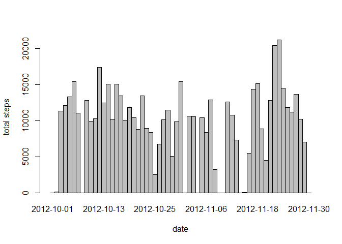
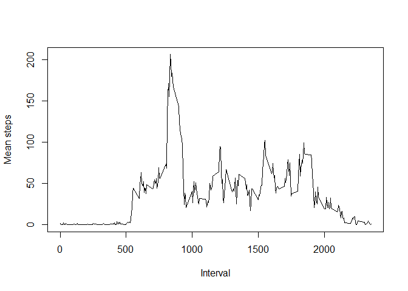
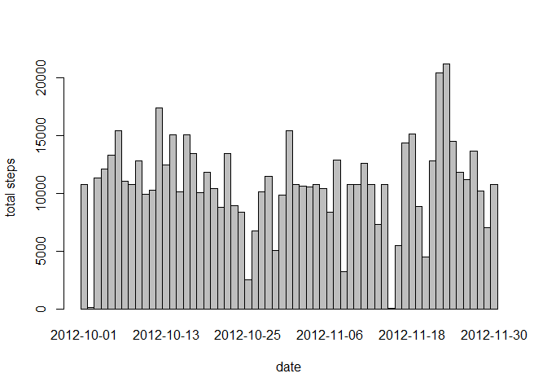
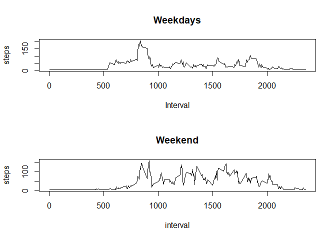

## Loading and preprocessing the data
It is important to convert dates to data format using as.Date()

```r
activity <- read.csv("activity.csv")
activity$date <- as.Date(activity$date, "%Y-%m-%d")
```

## What is mean total number of steps taken per day?

```r
tapply(activity$steps, weekdays(activity$date), mean, na.rm=T)
```

```
##   domingo    jueves     lunes    martes miércoles    sábado   viernes 
##  42.63095  28.51649  34.63492  31.07485  40.94010  43.52579  42.91567
```

```r
tapply(activity$steps, weekdays(activity$date), median, na.rm=T)
```

```
##   domingo    jueves     lunes    martes miércoles    sábado   viernes 
##         0         0         0         0         0         0         0
```

```r
barplot(tapply(activity$steps, activity$date, sum, na.rm=T), space = 0, ylab="total steps", xlab="date")
```

<!-- -->

## What is the average daily activity pattern?

```r
pattern <- tapply(activity$steps, activity$interval, mean, na.rm=T)
plot(names(pattern), pattern, type="l",xlab="Interval", ylab="Mean steps")
```

<!-- -->

```r
which.max(pattern)
```

```
## 835 
## 104
```


## Imputing missing values

```r
sum(is.na(activity))
```

```
## [1] 2304
```

```r
activity$steps[is.na(activity$steps)] <- mean(activity$steps, na.rm=T)
activity2 <- activity
tapply(activity2$steps, weekdays(activity2$date), mean, na.rm=T)
```

```
##   domingo    jueves     lunes    martes miércoles    sábado   viernes 
##  41.97491  29.50162  35.24552  31.07485  40.54483  42.75789  41.68610
```

```r
tapply(activity2$steps, weekdays(activity2$date), median, na.rm=T)
```

```
##   domingo    jueves     lunes    martes miércoles    sábado   viernes 
##         0         0         0         0         0         0         0
```

```r
barplot(tapply(activity2$steps, activity2$date, sum, na.rm=T), space = 0, ylab="total steps", xlab="date")
```

<!-- -->

## Are there differences in activity patterns between weekdays and weekends?

```r
library(dplyr)
```

```
## Warning: package 'dplyr' was built under R version 3.5.3
```

```
## 
## Attaching package: 'dplyr'
```

```
## The following objects are masked from 'package:stats':
## 
##     filter, lag
```

```
## The following objects are masked from 'package:base':
## 
##     intersect, setdiff, setequal, union
```

```r
activity2 <- mutate(activity2, day = case_when(weekdays(activity2$date)=="sábado"~"weekend", weekdays(activity2$date)=="domingo"~"weekend", weekdays(activity2$date)=="lunes"~"weekday", weekdays(activity2$date)=="martes"~"weekday", weekdays(activity2$date)=="miércoles"~"weekday", weekdays(activity2$date)=="jueves"~"weekday", weekdays(activity2$date)=="viernes"~"weekday"))
weekday <- activity2[activity2$day == "weekday", ]
weekend <- activity2[activity2$day == "weekend", ]
weekday_pat <- tapply(weekday$steps, weekday$interval, mean)
weekend_pat <- tapply(weekend$steps, weekend$interval, mean)
par(mfrow=c(2,1))
plot(names(weekday_pat), weekday_pat, type="l", main="Weekdays", ylab="steps", xlab="Interval")
plot(names(weekend_pat), weekend_pat, type="l", main="Weekend", ylab = "steps", xlab = "interval")
```

<!-- -->


